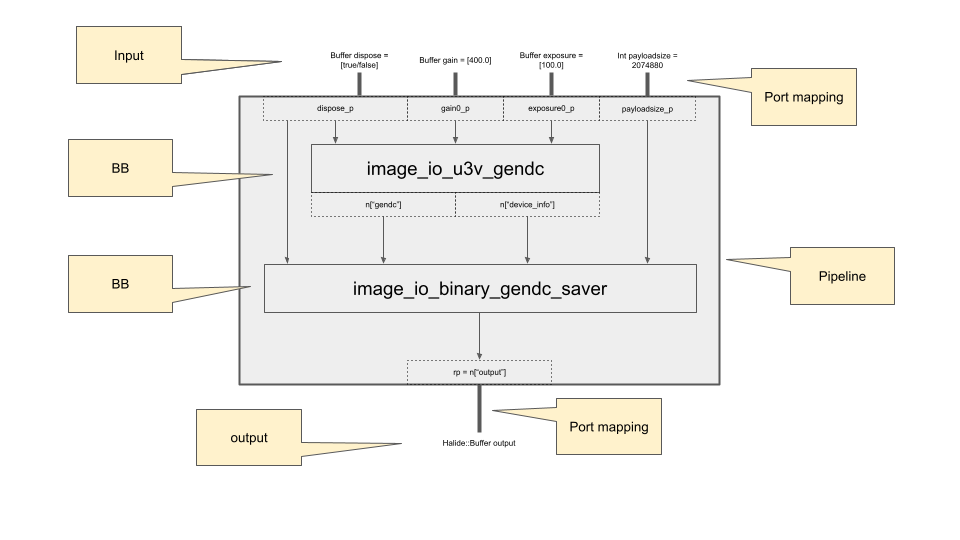

# Save GenDC (Add BB)

In this tutorial, we learn how to save whole GenDC data with Descriptor and Data.

## Prerequisite

* ionpy 
* numpy
* OpenCV

```bash
pip3 install -U pip
pip3 install opencv-python
pip3 install opencv-contrib-python
pip3 install numpy
pip3 install "git+https://github.com/fixstars/ion-kit.git#egg=ionpy&subdirectory=python"
```

* Aravis Python (included in SDK package)
* PyGObject (included in SDK package)

## Tutorial

### Get Device Information

To obtain the whoe GenDC, we need to know the following information of the device.
* PixelFormat

Similarly, the following values are required to save the whole GenDC.

* Width
* Height
* PayloadSize

The [first tutorial](obtain-device-info.md) or [arv-tool-0.8](../external/aravis/arv-tools.md) will help to get these values.

### Create directory

Before build and execute the pipeline to obtain and save GenDC, we create the directory `tutorial2_saved_gendc_YYYYmmDDHHMMSS` to store the data.

```python
save_data_directory = 'tutorial2_saved_gendc_' + datetime.datetime.now().strftime('%Y%m%d%H%M%S')
os.mkdir(save_data_directory)
```

### Build a pipeline

We learn how to build a pipeline in the [previous tutorial](display-image.md); and this time we use BB `image_io_u3v_gendc` instead of `image_io_u3v_cameraN_u<bit-depth>x<dimension>` to obtain a whole GenDC instead of image data.

We have tried to build the pipeline consisting of a single BB, and in this tutorial, we will add another BB `image_io_binary_gendc_saver` to the pipeline as follows.



Note that some inputs of the second BB is the output of the first BB, while the other inputs are the input of pipeline. Therefore, we should not forget to set the port and port-mapping of them.

```python
# set port
...
payloadsize_p = Port('payloadsize', Type(TypeCode.Int, 32, 1), 0)

...
# set I/O ports
port_map.set_i32(payloadsize_p, payloadsize)
```

:::caution why it does not work
Any BB can be added to yor pipeline, as long as both input/output ports requires the appropriate type and dimension, which is defined by each BB.

For example, one of the output `image_io_u3v_gendc` named  `"gendc"` can be an input of `image_io_binary_gendc_saver` since both type is the **array of Uint8 Buffer and 1D**.
:::

### Execute the pipeline

The pipeline is ready to run. See the detail in the [previous tutorial](display-image)

### Saved GenDC

The GenDC data would be saved in `raw-X.bin` files under the directory that we created in [the section above](#create-directory). These raw files can be loaded with **GenDC Separator** so that you can get a particular sensor data.

We introduce how to use **GenDC Separator** in other tutorials: [Generate Video](generate-video) and [Generate Numpy Array](generate-numpy).

## Complete code

Complete code used in the tutorial is [here](https://github.com/Sensing-Dev/tutorials/blob/main/python/tutorial2_save_gendc.py)