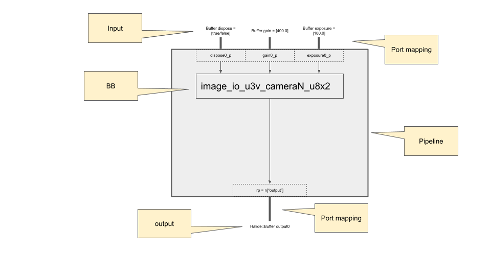

# 画像の表示

このチュートリアルでは、ion-kitを使用してデバイスから画像データを取得し、表示する方法を学びます。

## 必要なもの

* ionpy
* numpy
* OpenCV

## チュートリアル

### デバイス情報の取得

ionpyを使用して画像を表示するには、デバイスの次の情報を取得する必要があります。

* 幅
* 高さ
* ピクセルフォーマット

[前のチュートリアル](obtain-device-info.md)または[arv-tool-0.8](../external/aravis/arv-tools.md)は、これらの値を取得するのに役立ちます。

### パイプラインの構築

まず、ion-kitのpythonバインディングであるionpyのモジュールを読み込みます。

```python
from ionpy import Node, Builder, Buffer, PortMap, Port, Param, Type, TypeCode
```

前の[紹介](intro.mdx)で学んだように、画像のI/Oおよび処理用のパイプラインを構築および実行します。

このチュートリアルでは、U3Vカメラから画像を取得するための単純なパイプラインを構築します。

以下のionpy APIはパイプラインを設定します。

```python
module_name = 'ion-bb.dll'
...
# パイプラインの設定
builder = Builder()
builder.set_target('host')
builder.with_bb_module(module_name)
```

`set_target`は、Builderによって構築されたパイプラインが実行されるハードウェアを指定します。

`ion-bb.dll`で定義されたBBを使用したい場合、`with_bb_module`関数でモジュールを読み込む必要があります。

使用するBBは`image_io_u3v_cameraN_u8x2`で、これは各ピクセルデータの深度が8ビットで2次元（たとえばMono8）のU3Vカメラ用に設計されています。

ピクセルフォーマットがMono10またはMono12の場合、それぞれ10ビットおよび12ビットのピクセルデータを格納するには`image_io_u3v_cameraN_u16x2`が必要です。

ピクセルフォーマットがRGB8の場合、ビット深度は8で、幅と高さに加えてカラーチャンネルも含まれるため、`image_io_u3v_cameraN_u8x3`を使用します。

これらのBBのいずれも、`dispose`、`gain`、および`exposuretime`と呼ばれる入力を必要とするため、値をパイプラインに渡すためにポートを設定する必要があります。

```python
# 入力ポートの設定
dispose_p = Port('dispose', Type(TypeCode.Uint, 1, 1), 0)
gain_p = Port('gain', Type(TypeCode.Float, 64, 1), 1)
exposuretime_p = Port('exposuretime', Type(TypeCode.Float, 64, 1), 1)
```

ポート入力は動的であり、各実行ごとに更新できます。静的な値を文字列で設定することもできます。

```python
# パラメータの設定
num_devices = Param('num_devices', str(num_device))
pixel_format_ptr = Param('pixel_format_ptr', "RGB8")
gain_key = Param('gain_key', 'Gain')
exposure_key = Param('exposure_key', 'ExposureTime')
```

`pixel_format_ptr`は[デバイス情報の取得](#get-device-information)で取得したピクセルフォーマットです。

:::caution なぜ動作しないのか
`gain_key`および`exposure_key`はGenICamのデバイスゲインと露出時間を制御するためのフィーチャーキーです。通常、**SFNC（Standard Features Naming Convention）**に従って、これらは通常、`Gain`および`ExposureTime`として設定され、`FLOAT64`型です。ただし、一部のデバイスは異なるキーと異なるタイプを持っている 
場合があります。

その場合、ポートのタイプとパラメータのキーの名前を変更する必要があるかもしれません。利用可能なフィーチャーをリストアップする方法については、[このページ](../external/aravis/arv-tools#list-the-available-genicam-features)を確認してください。
```python
gain_p = Port('gain', Type(<TypeCode>, <データタイプのサイズ>, 1), 1)
exposuretime_p = Port('exposuretime', Type(<TypeCode>, <データタイプのサイズ>, 1), 1)

gain_key = Param('gain_key', <ゲインを制御するフィーチャーの名前>)
exposure_key = Param('exposure_key', <露出時間を制御するフィーチャーの名前>)
```
:::

次に、ポートとパラメータを持つノードとしてBBをパイプラインに追加します。

```python
# パイプラインにノードを追加
node = builder.add(bb_name)\
    .set_port([dispose_p, gain_p, exposuretime_p, ])\
    .set_param([pixel_format_ptr, gain_key, exposure_key, ])
output_p = node.get_port('output')
```

これが私たちのパイプライン内の唯一のBBであるため、ノードの出力ポートはパイプラインの出力ポートとして機能し、その名前は `output_p` です。

BBとポートを備えた私たちのパイプラインは次のようになります:



入力値を渡し、ポートから出力データを取得するには、入力と出力のバッファを準備し、バッファをポートにマッピングして、ポートをバッファにマッピングする必要があります。

```python
# 入力ポート用のHalideバッファを作成
gain_data = np.array([48.0])
exposure_data = np.array([100.0])

gains = Buffer(Type(TypeCode.Float, 64, 1), (1,))
exposures = Buffer(Type(TypeCode.Float, 64, 1), (1,))
gains.write(gain_data.tobytes(order='C'))
exposures.write(exposure_data.tobytes(order='C'))

# 出力ポート用のHalideバッファを作成
outputs = []
output_size = (width, height, )
outputs.append(Buffer(Type(TypeCode.Uint, depth_of_buffer, 1), output_size))

# I/Oポートの設定
port_map = PortMap()
port_map.set_buffer(gain_p, gains)
port_map.set_buffer(exposuretime_p, exposures)
port_map.set_buffer_array(output_p, outputs)
port_map.set_u1(dispose_p, False)
```

ここでの `output_size` は2D画像向けに設計されています。ピクセルフォーマットがRGB8の場合、カラーチャネルを追加するために `(width, height, 3)` を設定する必要があります。

`depth_of_buffer` はビット単位でのピクセルサイズです。例えば、Mono8およびRGB8の場合は `8` 、Mono10およびMono12の場合は `16` です。

### パイプラインの実行

パイプラインは実行準備が整っています。

このチュートリアルのコードでは、入力ポートにマッピングされたゲインと露出時間の値は任意ですが、デバイスを解放するために実行中に`False`に設定し、プログラムの実行の最後に`True`に設定する必要があります。

```python
for x in range(loop_num):
    port_map.set_u1(dispose_p, x==loop_num-1)
    # ビルダーの実行
    builder.run(port_map)
```

動的ポートを設定した後、`builder.run`を使用してパイプラインを実行します。

### OpenCVで表示

出力データ（つまり画像データ）がBuffer `outputs`にマッピングされているため、これをOpenCVバッファにコピーして画像処理または表示できます。

OpenCVはバッファ上のチャネル（次元）の順序が異なることに注意してください。

```python
buf_size_opencv = (height, width)
output_byte_size = width*height*depth_in_byte
```
`depth_in_byte`はバイト単位のピクセルサイズです。例えば、Mono8およびRGB8の場合は `1` 、Mono10およびMono12の場合は `2` です。

前に学んだように、デバイスのピクセルフォーマットがRGB8の場合、カラーチャンネルを追加するには `(height, width, 3)` を設定する必要があります。

画像データをバイトバッファにコピーし、それを表示するためにNumpy配列にコピーします。

```python
output_bytes = outputs[0].read(output_byte_size)

output_np_HxW = np.frombuffer(output_bytes, data_type).reshape(buf_size_opencv)
output_np_HxW *= pow(2, num_bit_shift)

cv2.imshow("A", output_np_HxW)
cv2.waitKey(0)
```

`outputs`はBufferのリストです（複数のデバイスを制御するために`num_device`を設定できます）、画像データを取得するには`outputs[0]`にアクセスします。

`for`ループ内でこのプロセスを繰り返すと、カメラデバイスからの連続した画像が表示されます。

`for`ループの後に画像を表示したウィンドウを破棄することを忘れないでください。

```python
cv2.destroyAllWindows()
```

## 完全なコード

チュートリアルで使用される完全なコードは[こちら](https://github.com/Sensing-Dev/tutorials/blob/main/python/tutorial1_display.py)です。
