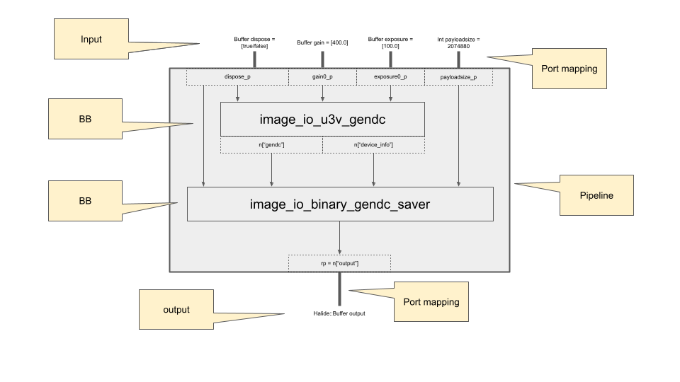

 # GenDC保存（BBを追加）

 このチュートリアルでは、記述子とデータと一緒にGenDCデータ全体を保存する方法について学びます。

 ## 必要なもの

 * ionpy
 * numpy
 * OpenCV

 ```bash
 pip3 install -U pip
 pip3 install opencv-python
 pip3 install opencv-contrib-python
 pip3 install numpy
 pip3 install "git+https://github.com/fixstars/ion-kit.git#egg=ionpy&subdirectory=python"     
 ```

 * Aravis Python（SDKパッケージに含まれています）
 * PyGObject（SDKパッケージに含まれています）


 ## チュートリアル

 ### デバイス情報の取得

 GenDC全体を取得するために、デバイスの以下の情報を知る必要があります。
 * ピクセルフォーマット

 同様に、GenDC全体を保存するためには以下の値が必要です。

 * 幅
 * 高さ
 * ペイロードサイズ

 [最初のチュートリアル](obtain-device-info.md)または[arv-tool-0.8](../external/aravis/arv-tools.md)はこれらの値を取得するのに役立ちます。


 ### ディレクトリの作成

 GenDCを取得して保存するために、データを保存するディレクトリ `tutorial2_saved_gendc_YYYYmmDDHHMMSS` を作成します。

 ```python
 save_data_directory = 'tutorial2_saved_gendc_' + datetime.datetime.now().strftime('%Y%m%d%H%M%S')
 os.mkdir(save_data_directory)
 ```

 ### パイプラインの構築

 [前のチュートリアル](display-image.md)でパイプラインの構築方法を学び、今回はイメージデータではなくGenDC全体を取得するためにBB `image_io_u3v_gendc` を使用します。

 単一のBBで構成されるパイプラインを構築しましたが、このチュートリアルでは別のBB `image_io_binary_gendc_saver` を次のようにパイプラインに追加します。

 

 2番目のBBの一部の入力は、最初のBBの出力であり、その他の入力はパイプラインの入力です。したがって、それらのポートとポートマッピングを設定するのを忘れないようにしましょう。

 ```python
 # ポートの設定
 ...
 payloadsize_p = Port('payloadsize', Type(TypeCode.Int, 32, 1), 0)

 ...
 # I/Oポートの設定
 port_map.set_i32(payloadsize_p, payloadsize)
 ```

 :::caution なぜ動作しないのか
 各BBが必要な適切なタイプと次元を定義する限り、パイプラインに任意のBBを追加できます。

 たとえば、1つの出力である`image_io_u3v_gendc`の名前は`"gendc"`であり、`image_io_binary_gendc_saver`の入力の1つになることができます。両方のタイプは「Uint8バッファの配列」と「1D」です。
 :::

 ### パイプラインの実行

 パイプラインは実行準備ができています。詳細は[前のチュートリアル](display-image)を参照してください。

 ### 保存されたGenDC

 GenDCデータは[前述のセクション](#create-directory)で作成したディレクトリ内の`raw-X.bin`ファイルに保存されます。これらのRAWファイルは**GenDC Separator**を使用して特定のセンサーデータを取得できます。

 **GenDC Separator**の使用方法は他のチュートリアルで紹介しています: [ビデオの生成](generate-video) および [NumPy配列の生成](generate-numpy)。

## 完全なコード

 このチュートリアルで使用される完全なコードは[ここにあります](https://github.com/Sensing-Dev/tutorials/blob/main/python/tutorial2_save_gendc.py)。